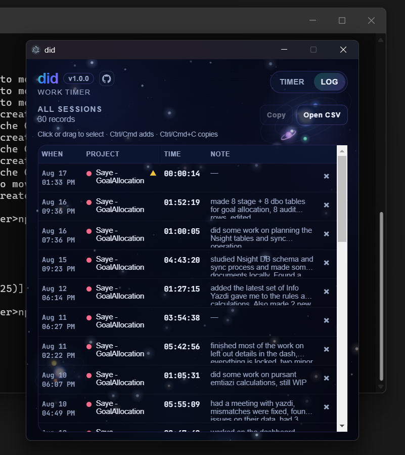
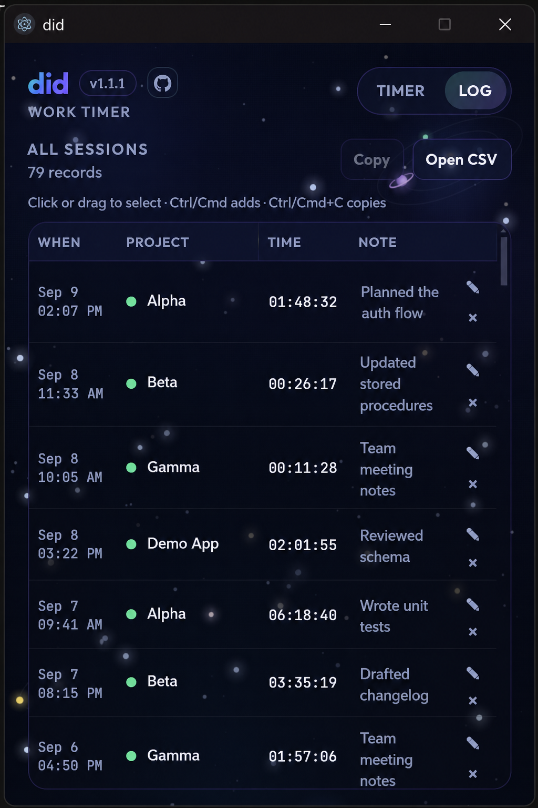
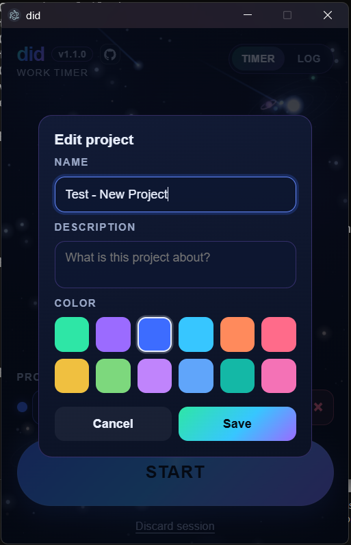
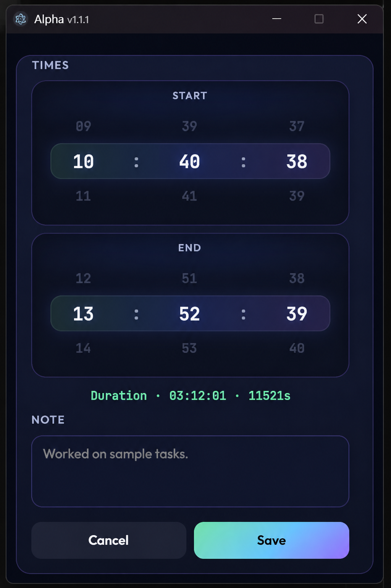
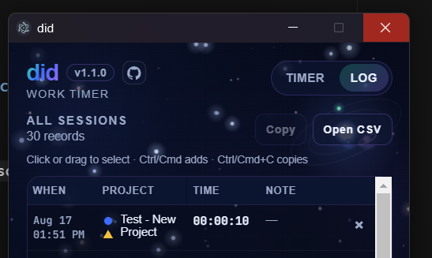

<p align="center">
  <strong>did</strong><br />
  A tiny, beautiful work timer — about the size of Windows Calculator.
</p>

<p align="center">
  <a href="https://github.com/ZareSaeed/did/releases/latest"></a>
  <a href="https://github.com/ZareSaeed/did/blob/main/LICENSE"></a>
  
</p>

---

## ✨ Preview

<table>
  <tr>
    <td align="center"><strong>⏱️ Timer</strong></td>
    <td align="center"><strong>📋 Log</strong></td>
  </tr>
  <tr>
    <td></td>
    <td></td>
  </tr>
  <tr>
    <td align="center"><strong>✏️ Edit project</strong></td>
    <td align="center"><strong>🕒 Edit session</strong></td>
  </tr>
  <tr>
    <td></td>
    <td></td>
  </tr>
  <tr>
    <td align="center" colspan="2"><strong>⚡ Power-cut recovery</strong></td>
  </tr>
  <tr>
    <td colspan="2" align="center">
      
    </td>
  </tr>
</table>

> 🌌 Space-themed backgrounds shift with your state — calm when idle, alive while recording, hushed when paused.

---

## 📥 Download

Get the latest installers from **[Releases](https://github.com/ZareSaeed/did/releases/latest)**.

| Platform | 📦 Packages |
|----------|-------------|
| 🪟 **Windows** | [Installer](https://github.com/ZareSaeed/did/releases/download/v1.1.2/did-1.1.2-win-x64-setup.exe) · [Portable](https://github.com/ZareSaeed/did/releases/download/v1.1.2/did-1.1.2-win-x64-portable.exe) |
| 🍎 **macOS** | [Apple Silicon](https://github.com/ZareSaeed/did/releases/download/v1.1.2/did-1.1.2-mac-arm64.dmg) · [Intel](https://github.com/ZareSaeed/did/releases/download/v1.1.2/did-1.1.2-mac-x64.dmg) |
| 🐧 **Linux** | [AppImage](https://github.com/ZareSaeed/did/releases/download/v1.1.2/did-1.1.2-linux-x86_64.AppImage) · [deb](https://github.com/ZareSaeed/did/releases/download/v1.1.2/did-1.1.2-linux-amd64.deb) |

### 🔄 Updating an existing install

Your data is stored separately from the app — updating is safe.

1. Close **did**
2. Download the new installer for your platform
3. Run it (installs over the old version)
4. Open **did** — projects and logs are still there

**Windows data folder:** `%APPDATA%\did`

---

## 🚀 Quick start (from source)

```bash
git clone https://github.com/ZareSaeed/did.git
cd did
npm install
npm start
```

---

## 🛠️ Build installers locally

```bash
npm install
npm run dist:win     # Windows setup + portable
npm run dist:mac     # macOS (requires macOS)
npm run dist:linux   # Linux AppImage + deb
```

Outputs land in `dist/`. Pushing a `v*` tag triggers GitHub Actions to build all platforms.

---

## 🎯 Features

### ⏱️ Timer
- Big **Start / Pause** button
- Optional note popup when pausing a session (up to 4000 characters)
- Per-project color accents on the timer UI

### 📁 Projects
- Add, select, **edit** (name · description · color), and delete
- Each project gets its own distinct color
- Edits apply to existing log entries too

### 📋 Session log
- Full history kept forever (Timer ↔ Log tabs)
- Edit session times and notes (notes up to 4000 characters)
- Delete individual rows (with confirmation)
- Click or drag to select · **Copy** as spreadsheet-ready TSV (oldest first)
- **Open CSV** — live export next to your app data

### 🌌 Backgrounds
- Animated space scenes for three states:
  - **Ready** — calm blue nebula
  - **Recording** — bright green/teal energy
  - **Paused** — soft purple stillness

### ⚡ Power-cut recovery
- If the PC shuts down mid-session, **did** recovers the record on next launch
- End time = last second the timer actually recorded
- ⚠️ Yellow triangle under the project dot marks interrupted sessions

### 🔧 Extras
- GitHub button + in-app version badge
- Auto-save between sessions
- Single-instance lock (no duplicate windows fighting over cache)

---

## 📄 License

MIT — see [LICENSE](LICENSE).

<p align="center">
  <sub>Made with ☕ and 🌌</sub>
</p>
